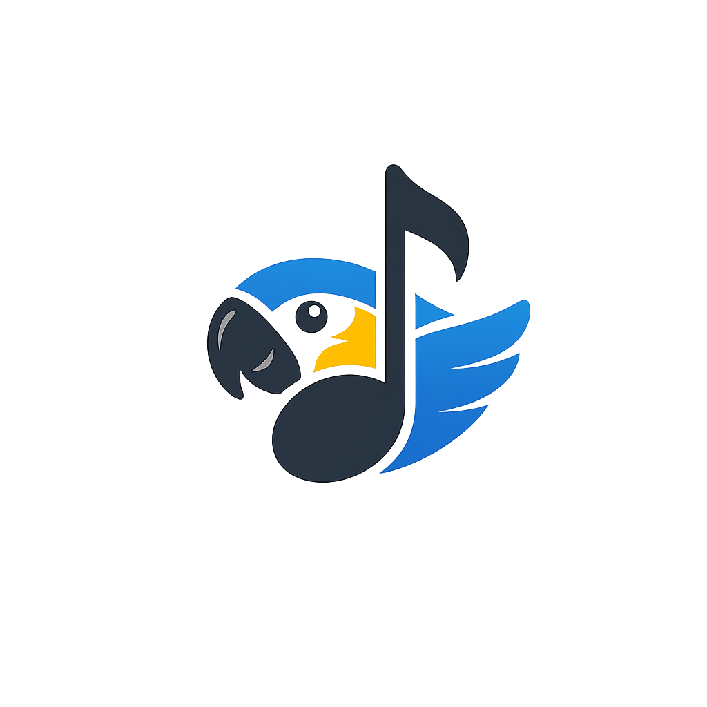

<div align="center">

</div>

# CanindeChords

Gestor colaborativo de canciones, acordes y setlists para músicos, con
sincronización en tiempo real (Modo Director). PWA construida con React + Vite +
Firebase. Creada originalmente en Google AI Studio.

## Arranque rápido

**Requisitos:** Node.js 22+

```bash
npm install
# Edita .env.local y pon tu GEMINI_API_KEY (ver .env.example)
npm run dev      # http://localhost:3000
```

## Publicación

La app se publica automáticamente en **Firebase Hosting** al hacer push a `main`
(vía GitHub Actions). La configuración completa de desarrollo y deploy está en
**[DEPLOY.md](DEPLOY.md)**.

URL pública: https://franco-control.web.app

## Documentación

- **[DEPLOY.md](DEPLOY.md)** — desarrollo local, secrets y publicación.
- **[AGENTS.md](AGENTS.md)** — arquitectura, reglas de negocio y workflows.
- **[TODO.md](TODO.md)** — backlog de mejoras.
